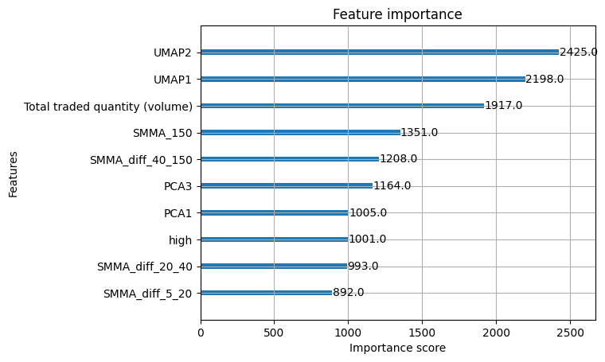
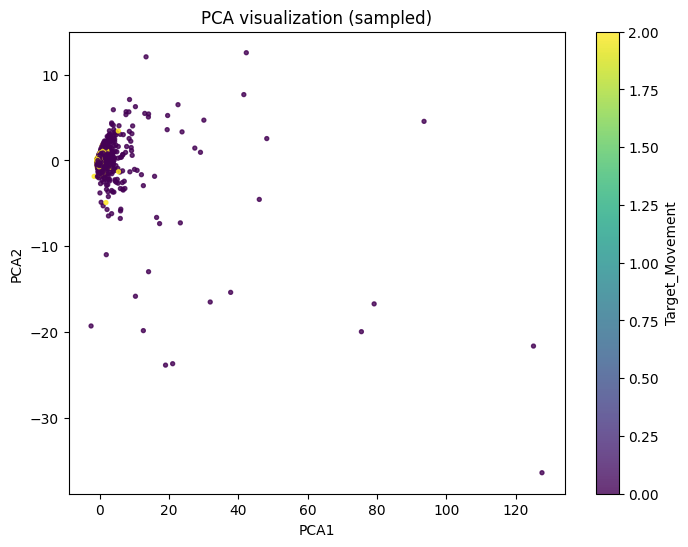
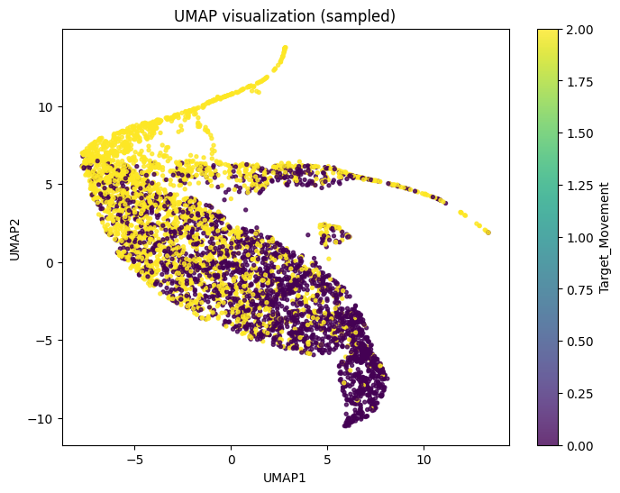

# 📈 Stock Price Prediction & Backtesting Framework

This project provides a complete pipeline for **stock price prediction, signal generation, and backtesting** using Machine Learning and Deep Learning techniques.  
It helps in:

- Predicting **future stock prices & movements** (classification + regression models).
- Comparing predictions across **different stocks**.
- Making **trading decisions** (e.g., Buy at Low, Sell at High).
- Validating results using **Sharpe Ratio, Drawdown, Accuracy**, and other metrics.
- Providing a **simple API** to input stock data and get predictions + backtesting reports.

---

## 🚀 Features
- Data preprocessing with OHLCV + technical indicators (SMMA, PCA, UMAP).
- Machine Learning models for regression & classification.
- Backtesting engine with **cumulative returns, Sharpe ratio, max drawdown**.
- Trade-level summary (Win rate, Avg PnL, #Trades).
- Visualization tools for **PCA/UMAP embeddings** and **Feature Importance**.
- API for prediction + backtesting.

---

## 📊 Visualizations

### 🔹 Feature Importance


### 🔹 PCA Projection


### 🔹 UMAP Projection


---

## 📦 Installation
```bash
git clone https://github.com/whoami-saloni/Stock-Price-Prediction.git
cd Stock-Price-Prediction
# Install UMAP
pip install umap-learn

# Install TensorFlow (latest stable version)
pip install tensorflow

# (Optional) If you want GPU support for TensorFlow
pip install tensorflow[and-cuda]

#run pipeline
python main.py
```

## 📈 Model Performance

🔹 Regression Model Results

RMSE: 3048.40

R²: 0.3724

🔹 Classification Results

✅ Accuracy: 0.7430

📊 Classification Report


               precision    recall  f1-score   support

           0       0.74      0.75      0.74    375338
           1       0.00      0.00      0.00        56
           2       0.75      0.74      0.74    375199

    accuracy                           0.74    750593
   macro avg       0.50      0.50      0.50    750593
weighted avg       0.74      0.74      0.74    750593

📉 Confusion Matrix

 [[281595      0  93743]
 [    17      0     39]
 [ 99099      0 276100]]

🔹 Backtesting (Few Entries)

date	      stock_id	close	signal	portfolio_value
2014-07-15	VISAKAIND	21.98	  0	      100000.000000
2014-07-15	IOB	      72.40	  0	      100000.000000
2014-07-15	HAVELLS	  244.39	0	      100000.000000
2014-07-15	ESABINDIA	621.35 -1	      100000.000000
2014-07-15	NLCINDIA	93.25	 -1	      184992.355355

## 📌 Future Improvements

You can add a roadmap for enhancements:

✅ Hyperparameter tuning with Optuna.

✅ Real-time stock data fetching from Yahoo Finance / Alpha Vantage APIs.

✅ Deploy API on Streamlit / FastAPI + Docker for production use.

✅ Portfolio optimization strategies.

## 🤝 Contributing

Encourage others to improve your repo:

Contributions are welcome!  
Fork the repo, create a new branch, make changes, and submit a Pull Request 🚀

## 📜 License

Add an open-source license (MIT / Apache 2.0 is common).
